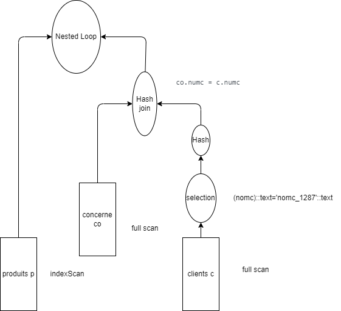
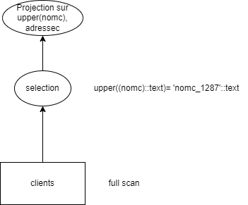

# MiniProjet

TESTS : https://sqliteonline.com/

# Ex1
## 1.1
### q3, 4
**Le nom et prénom du client numéro 5**
```sql
SELECT cli_nom, cli_prenom FROM client WHERE cli_id = 5;
```
```bash
Seq Scan on client  (cost=0.00..12.88 rows=1 width=156)
  Filter: (cli_id = 5)
```
Accès sequentiel sur client puis selection sur cli_id

**Les jours où le client numéro 5 a occupé une chambre**
```sql 
SELECT jour FROM occupation WHERE cli_id = 5;
```
```bash
Seq Scan on occupation  (cost=0.00..22.38 rows=5 width=38)
  Filter: (cli_id = 5)
```
Accès sequentiel sur occupation puis selection sur cli_id

**Les chambres occupées le 1999-01-22**
```sql 
SELECT chb_id FROM occupation WHERE jour = '1999-01-22';
```
```bash
Seq Scan on occupation  (cost=0.00..22.38 rows=5 width=4)
  Filter: ((jour)::text = '1999-01-22'::text)
```
Accès sequentiel sur occupation puis selection sur jour

**Le nom et prénom des clients ayant pris une chambre le 1999-01-22**
```sql 
SELECT cli_nom, cli_prenom FROM occupation o, client cl WHERE 
    cl.cli_id = o.cli_id AND jour = '1999-01-22';
```
```bash
Hash Join  (cost=22.44..35.66 rows=6 width=156) (actual time=0.029..0.031 rows=0 loops=1)
  Hash Cond: (cl.cli_id = o.cli_id)
  ->  Seq Scan on client cl  (cost=0.00..12.30 rows=230 width=160) (actual time=0.027..0.028 rows=0 loops=1)
  ->  Hash  (cost=22.38..22.38 rows=5 width=4) (never executed)
        ->  Seq Scan on occupation o  (cost=0.00..22.38 rows=5 width=4) (never executed)
              Filter: ((jour)::text = '1999-01-22'::text)
Planning Time: 0.167 ms
Execution Time: 0.106 ms
```

Accès sequentiel sur client, accès sequentiel sur occupation et filtrage sur jour avant de construire une table de hashage, puis jointure avec un hash-join entre la table de hashage et les clients.


## 1.2
### q1
```sql
CREATE UNIQUE INDEX idx_client_cli_id ON client(cli_id);
CREATE INDEX idx_occupation_cli_id ON occupation(cli_id);
CREATE INDEX idx_occupation_jour ON occupation(jour);
```
### q2

a) Ne change pas :
```bash
Seq Scan on client  (cost=0.00..12.88 rows=1 width=156) (actual time=0.015..0.015 rows=0 loops=1)
  Filter: (cli_id = 5)
Planning Time: 0.082 ms
Execution Time: 0.042 ms
```
Il semblerait que l'on n'utilise pas l'index sur client car pour un petite table ce n'est pas rentable. En effet, quand on utilise explain analyse, on se rend compte que la table tient sur **une seule page**. Ainsi, parcourir l'index ne ferait que parcourir des blocs suplementaires et donc irait plus lentment.

b) Pour faire simple, cela revient à un index scan sur cli_id = 5
```bash
Bitmap Heap Scan on occupation  (cost=4.19..12.66 rows=5 width=38) (actual time=0.018..0.019 rows=0 loops=1)
  Recheck Cond: (cli_id = 5)
  ->  Bitmap Index Scan on idx_occupation_cli_id  (cost=0.00..4.19 rows=5 width=0) (actual time=0.005..0.006 rows=0 loops=1)
        Index Cond: (cli_id = 5)
Planning Time: 0.498 ms
Execution Time: 0.053 ms
```

c) index scan sur occupation(jour):
```bash
Bitmap Heap Scan on occupation  (cost=4.19..12.66 rows=5 width=4) (actual time=0.021..0.022 rows=0 loops=1)
  Recheck Cond: ((jour)::text = '1999-01-22'::text)
  ->  Bitmap Index Scan on idx_occupation_jour  (cost=0.00..4.19 rows=5 width=0) (actual time=0.009..0.010 rows=0 loops=1)
        Index Cond: ((jour)::text = '1999-01-22'::text)
Planning Time: 0.189 ms
Execution Time: 0.058 ms
```
d) hash, hash join et index scan à droite (plus rentable pour le cas d'une petite table, même argument que pour la a))
```bash
Hash Join  (cost=12.72..25.94 rows=5 width=156) (actual time=0.007..0.008 rows=0 loops=1)
  Hash Cond: (cl.cli_id = o.cli_id)
  ->  Seq Scan on client cl  (cost=0.00..12.30 rows=230 width=160) (actual time=0.006..0.006 rows=0 loops=1)
  ->  Hash  (cost=12.66..12.66 rows=5 width=4) (never executed)
        ->  Bitmap Heap Scan on occupation o  (cost=4.19..12.66 rows=5 width=4) (never executed)
              Recheck Cond: ((jour)::text = '1999-01-22'::text)
              ->  Bitmap Index Scan on idx_occupation_jour  (cost=0.00..4.19 rows=5 width=0) (never executed)
                    Index Cond: ((jour)::text = '1999-01-22'::text)
Planning Time: 0.169 ms
Execution Time: 0.034 ms
```


# Ex2

## 2.1 Initialisation
## 2.2 Plans d'execution

A; Cout tot + Temps exec
B; Nb tuples + taille en octets pour chacun
C; Nb bloc lu
D; Type d'accès
E; Algorithmes

### 1
```sql
SELECT *
FROM optimisation.produits;
```
```bash
Seq Scan on produits  (cost=0.00..14.00 rows=500 width=109) (actual time=0.023..0.148 rows=500 loops=1)
  Buffers: shared hit=9
Planning Time: 0.076 ms
Execution Time: 0.232 ms
```
```text
A; Cout total : 14, Temps exec : 0.232ms
B; Nb tuples : 500, Taille en octets : 109
C; Nb blocs : 9
D; Sequentiel
E; -
```

### 2

```sql
SELECT NumP,NomP
FROM optimisation.produits;
```
```bash
Seq Scan on produits  (cost=0.00..14.00 rows=500 width=12) (actual time=0.027..0.201 rows=500 loops=1)
  Buffers: shared hit=9
Planning Time: 0.074 ms
Execution Time: 0.286 ms
```
```text
A; Cout total : 14, Temps exec : 0.286ms 
B; Nb tuples : 500, Taille en octets : 12
C; Nb blocs : 9
D; Sequentiel
E; -
```

### 3
```sql
SELECT distinct NumP,NomP
FROM optimisation.produits;
```
```bash
HashAggregate  (cost=16.50..21.50 rows=500 width=12) (actual time=0.623..0.830 rows=500 loops=1)
  Group Key: nump, nomp
  Batches: 1  Memory Usage: 73kB
  Buffers: shared hit=9
  ->  Seq Scan on produits  (cost=0.00..14.00 rows=500 width=12) (actual time=0.022..0.150 rows=500 loops=1)
        Buffers: shared hit=9
Planning:
  Buffers: shared hit=13
Planning Time: 0.204 ms
Execution Time: 0.945 ms
```
A; Cout total : 21.50, Temps exec : 0.945ms
B; Nb tuples : 500, Taille en octets : 12
C; Nb blocs : 9
D; Sequentiel
E; Table de hashage pour le distinct

### 4
```sql
SELECT distinct NumP,NomP
FROM optimisation.produits
ORDER BY NomP asc;
```
```bash
Unique  (cost=36.41..40.16 rows=500 width=12) (actual time=3.374..3.688 rows=500 loops=1)
  Buffers: shared hit=9
  ->  Sort  (cost=36.41..37.66 rows=500 width=12) (actual time=3.372..3.451 rows=500 loops=1)
        Sort Key: nomp, nump
        Sort Method: quicksort  Memory: 40kB
        Buffers: shared hit=9
        ->  Seq Scan on produits  (cost=0.00..14.00 rows=500 width=12) (actual time=0.028..0.263 rows=500 loops=1)
              Buffers: shared hit=9
Planning Time: 0.116 ms
Execution Time: 3.786 ms
```
A; Cout total : 40.16, Temps exec : 3.786ms
B; Nb tuples : 500, Taille en octets : 12
C; Nb blocs : 9
D; Sequentiel
E; Tri (quicksort) + Unique pour le order by

### 5
```sql
SELECT *
FROM optimisation.produits
where NomP='nomp_327'
```
```bash
Seq Scan on produits  (cost=0.00..15.25 rows=1 width=109) (actual time=0.186..0.187 rows=0 loops=1)
  Filter: ((nomp)::text = 'nomp_327'::text)
  Rows Removed by Filter: 500
  Buffers: shared hit=9
Planning Time: 0.189 ms
Execution Time: 0.210 ms
```
A; Cout total : 15.25, Temps exec : 0.210ms
B; Nb tuples : 0, Taille en octets : 109
C; Nb blocs : 9
D; Sequentiel
E; -

### 6
```sql
SELECT distinct co.NumC,COUNT(*) as nombre
FROM optimisation.commandes as co
GROUP BY co.NumC;
```
```bash
HashAggregate  (cost=72.23..77.10 rows=487 width=12) (actual time=2.230..2.432 rows=487 loops=1)
  Group Key: numc, count(*)
  Batches: 1  Memory Usage: 73kB
  Buffers: shared hit=35
  ->  HashAggregate  (cost=64.92..69.80 rows=487 width=12) (actual time=1.662..1.900 rows=487 loops=1)
        Group Key: numc
        Batches: 1  Memory Usage: 73kB
        Buffers: shared hit=35
        ->  Seq Scan on commandes co  (cost=0.00..54.95 rows=1995 width=4) (actual time=0.016..0.451 rows=1995 loops=1)
              Buffers: shared hit=35
Planning:
  Buffers: shared hit=31 dirtied=1
Planning Time: 0.405 ms
Execution Time: 2.589 ms
```
A; Cout total : 77.10, Temps exec : 2.589ms
B; Nb tuples : 487, Taille en octets : 12
C; Nb blocs : 35
D; Sequentiel
E; HashAggregate (group by + distinct + count, on utilise une table de hachage)

### 7
```sql
SELECT
    cl.NomC AS "nom du client",
    co.DateCom AS "date de la commande"
FROM
    optimisation.clients AS cl
INNER JOIN
    optimisation.commandes AS co
ON
    cl.NumC = co.NumC; 
```
```bash
Hash Join  (cost=20.25..80.48 rows=1995 width=12) (actual time=0.541..2.232 rows=1995 loops=1)
  Hash Cond: (co.numc = cl.numc)
  Buffers: shared hit=44
  ->  Seq Scan on commandes co  (cost=0.00..54.95 rows=1995 width=8) (actual time=0.018..0.429 rows=1995 loops=1)
        Buffers: shared hit=35
  ->  Hash  (cost=14.00..14.00 rows=500 width=12) (actual time=0.495..0.496 rows=500 loops=1)
        Buckets: 1024  Batches: 1  Memory Usage: 32kB
        Buffers: shared hit=9
        ->  Seq Scan on clients cl  (cost=0.00..14.00 rows=500 width=12) (actual time=0.016..0.196 rows=500 loops=1)
              Buffers: shared hit=9
Planning:
  Buffers: shared hit=56 dirtied=3
Planning Time: 0.883 ms
Execution Time: 2.534 ms
```
A; Cout total : 80.48, Temps exec : 2.534ms
B; Nb tuples : 1995, Taille en octets : 12
C; Nb blocs : 44
D; Sequentiel 
E; Hash Join via table de hashage

On utilise finalement la table commande, seulement on n'utilise pas l'index dessus : en effet, l'index se trouve être (datecom, numc) ce qui le rend inutilisable pour un join sur numc.
Pour ce qui est de l'ordre, il faut voir du coté du nombre de lignes de chaque table, ce qui permet d'avoir un coût inferieur.
Cela fait que parmi les variantes que nous avons testé (join manuel dans un where, left et right join), rien ne change dans le PEP.

### Requête 8

```sql
select distinct nomc , nomp
from optimisation.clients , optimisation.concerne , optimisation.produits , optimisation.commandes ,
optimisation.livraisons
where optimisation.clients.numc = optimisation.commandes.numc
and optimisation.commandes.datecom = optimisation.concerne.datecom
and optimisation.commandes.numc = optimisation.concerne.numc
and optimisation.produits.nump = optimisation.concerne.nump
```

```bash
HashAggregate  (cost=100114.17..100937.37 rows=82320 width=16)
  Group Key: clients.nomc, produits.nomp
  ->  Merge Join  (cost=543.79..54241.77 rows=9174480 width=16)
        Merge Cond: ((commandes.datecom = concerne.datecom) AND (commandes.numc = clients.numc))
        ->  Nested Loop  (cost=0.28..38108.00 rows=3040380 width=8)
              ->  Index Only Scan using commandes_pkey on commandes  (cost=0.28..74.20 rows=1995 width=8)
              ->  Materialize  (cost=0.00..32.86 rows=1524 width=0)
                    ->  Seq Scan on livraisons  (cost=0.00..25.24 rows=1524 width=0)
        ->  Sort  (cost=543.49..558.54 rows=6020 width=28)
              Sort Key: concerne.datecom, clients.numc
              ->  Hash Join  (cost=40.50..165.57 rows=6020 width=28)
                    Hash Cond: (concerne.nump = produits.nump)
                    ->  Hash Join  (cost=20.25..129.39 rows=6020 width=24)
                          Hash Cond: (concerne.numc = clients.numc)
                          ->  Seq Scan on concerne  (cost=0.00..93.20 rows=6020 width=12)
                          ->  Hash  (cost=14.00..14.00 rows=500 width=12)
                                ->  Seq Scan on clients  (cost=0.00..14.00 rows=500 width=12)
                    ->  Hash  (cost=14.00..14.00 rows=500 width=12)
                          ->  Seq Scan on produits  (cost=0.00..14.00 rows=500 width=12)
```


Avant toute chose, on peut remarquer que d'un point de vue sémantique,
on cherche à faire un grand join de la plupart des tables,
et un produit cartesien sur livraisons pour récupérer tous les noms distincts.

Ainsi, On remarque que les coûts les plus importants sont le HashAggregate (c'est à dire ce qui fait office de distinct) 
et le Merge Join, ainsi que la Nested Loop.
Vu qu'on fait un grand join sur l'ensemble des tables, et qu'on y adjoint L'ENSEMBLE des livraisons, 
on est amené à traiter beaucoup de lignes.
Ainsi, en remontant les noeuds à chaque étape, en particulier au niveau de la nested loop qui traite les livraisons,
le nombre de ligne en sortie croit exponentiellement.
C'est le noeud HashAggregate qui traite le plus grand nombre de ligne, d'où le fait que son
cout total soit le plus élevé.

En retirant la table "livraison" du ```FROM```, le cout total passe à 312 contre plus de 100 000 sinon.

Si on tenait à executer cette requête sans trop latence, on pourrait donc juste retirer cette partie, car son schema montre bien qu'elle n'apporte aucun nouveau nomc/nomp ni n'en filtre.

## 2.3 Optimisation par des indexs

### 2.3.2
#### PEP dessins

#### A
```bash
Index Scan using commandes_pkey on commandes  (cost=0.28..8.30 rows=1 width=105)
  Index Cond: ((datecom = '2020-09-17'::date) AND (numc = 10))
```
#### B
```bash
Index Scan using commandes_pkey on commandes  (cost=0.28..8.29 rows=1 width=105)
  Index Cond: (datecom = '2020-09-17'::date)
```
#### C
```bash
Seq Scan on commandes  (cost=0.00..59.95 rows=3 width=105)
  Filter: (numc = 10)
```
#### Question b)

Issu de la documentation :

*Chemins d'accès dans PostgreSQL :
Les chemins d'accès (ou "access methods") dans PostgreSQL définissent comment les données sont stockées et accédées. Voici quelques types de chemins d'accès courants :*

*Heap (Tas) :
Le chemin d'accès par défaut pour les tables ordinaires. Les données sont stockées sans ordre particulier.*

*B-tree (Arbre B) :
Utilisé pour les index, y compris les index de clé primaire. Permet des recherches, des insertions, des suppressions et des accès séquentiels efficaces.*

*Hash :
Utilisé pour les index basés sur des tables de hachage. Efficace pour les recherches d'égalité.*

*GiST (Generalized Search Tree) :
Un cadre extensible pour les index qui peut être utilisé pour des types de données complexes comme les géométries.*

*GIN (Generalized Inverted Index) :
Utilisé pour les index inversés, souvent pour les recherches de texte intégral.*

*BRIN (Block Range INdex) :
Utilisé pour les index sur des colonnes où les valeurs sont physiquement proches les unes des autres.*

### 2.3.3
**a)**
```bash
Nested Loop  (cost=24.54..135.83 rows=12 width=8)"
  ->  Hash Join  (cost=24.26..132.17 rows=12 width=4)"
        Hash Cond: (co.numc = c.numc)"
        ->  Seq Scan on concerne co  (cost=0.00..92.23 rows=5923 width=8)"
        ->  Hash  (cost=24.25..24.25 rows=1 width=4)"
              ->  Seq Scan on clients c  (cost=0.00..24.25 rows=1 width=4)"
                    Filter: ((nomc)::text = 'nomc_1287'::text)"
  ->  Index Scan using produits_pkey on produits p  (cost=0.27..0.30 rows=1 width=12)"
        Index Cond: (nump = co.nump)"
```
**b)**



**c)**
```sql
CREATE INDEX clients_nomc on optimisation.clients (nomc);
CREATE INDEX concerne_nomc on optimisation.concerne (numc);
```
**d)**
```bash
Nested Loop  (cost=4.92..41.47 rows=12 width=8)
  ->  Nested Loop  (cost=4.65..37.88 rows=12 width=4)
        ->  Index Scan using clients_nomc on clients c  (cost=0.27..8.29 rows=1 width=4)
              Index Cond: ((nomc)::text = 'nomc_1287'::text)
        ->  Bitmap Heap Scan on concerne co  (cost=4.38..29.47 rows=12 width=8)
              Recheck Cond: (numc = c.numc)
              ->  Bitmap Index Scan on concerne_nomc  (cost=0.00..4.37 rows=12 width=0)
                    Index Cond: (numc = c.numc)
  ->  Index Scan using produits_pkey on produits p  (cost=0.27..0.30 rows=1 width=12)
        Index Cond: (nump = co.nump)
```

Ici l'utilisation des index a permi d'ameliorer considerablement le cout (une division de l'ordre d'à peu près 3).

C'est principalement grace aux accès par index pour le join (nested loop), là où avant on était contraint de faire un hash join.

### 2.3.4

**requête-a )**

```bash
Seq Scan on optimisation.clients  (cost=28.55..43.80 rows=250 width=4) (actual time=1.360..1.661 rows=20 loops=1)
  Output: clients.numc
  Filter: (NOT (ANY (clients.numc = (hashed SubPlan 1).col1)))
  Rows Removed by Filter: 480
  SubPlan 1
    ->  Seq Scan on optimisation.livraisons  (cost=0.00..24.84 rows=1484 width=4) (actual time=0.012..0.548 rows=1484 loops=1)
          Output: livraisons.numc
Planning Time: 0.591 ms
Execution Time: 1.763 ms
```

**requête-b )**

```bash
HashSetOp Except  (cost=0.00..73.56 rows=500 width=8) (actual time=1.163..1.182 rows=20 loops=1)
  Output: "SELECT 1".numc, (0)
  ->  Append  (cost=0.00..68.60 rows=1984 width=8) (actual time=0.015..0.765 rows=1984 loops=1)
        ->  Subquery Scan on "SELECT 1"  (cost=0.00..19.00 rows=500 width=8) (actual time=0.014..0.173 rows=500 loops=1)
              Output: "SELECT 1".numc, 0
              ->  Seq Scan on optimisation.clients  (cost=0.00..14.00 rows=500 width=4) (actual time=0.013..0.103 rows=500 loops=1)
                    Output: clients.numc
        ->  Subquery Scan on "SELECT 2"  (cost=0.00..39.68 rows=1484 width=8) (actual time=0.010..0.409 rows=1484 loops=1)
              Output: "SELECT 2".numc, 1
              ->  Seq Scan on optimisation.livraisons  (cost=0.00..24.84 rows=1484 width=4) (actual time=0.009..0.210 rows=1484 loops=1)
                    Output: livraisons.numc
Planning Time: 0.090 ms
Execution Time: 1.216 ms
```

**requête-c )**

```bash
Hash Anti Join  (cost=43.39..61.24 rows=20 width=4) (actual time=1.116..1.439 rows=20 loops=1)
  Output: clients.numc
  Hash Cond: (clients.numc = livraisons.numc)
  ->  Seq Scan on optimisation.clients  (cost=0.00..14.00 rows=500 width=4) (actual time=0.020..0.143 rows=500 loops=1)
        Output: clients.numc, clients.nomc, clients.adressec
  ->  Hash  (cost=24.84..24.84 rows=1484 width=4) (actual time=1.071..1.073 rows=1484 loops=1)
        Output: livraisons.numc
        Buckets: 2048  Batches: 1  Memory Usage: 69kB
        ->  Seq Scan on optimisation.livraisons  (cost=0.00..24.84 rows=1484 width=4) (actual time=0.012..0.462 rows=1484 loops=1)
              Output: livraisons.numc
Planning Time: 0.719 ms
Execution Time: 1.482 ms
```

### 2.3.5

**a)**
```bash
Seq Scan on clients  (cost=0.00..16.50 rows=2 width=129) (actual time=0.663..1.053 rows=2 loops=1)
  Filter: (upper((nomc)::text) = 'NOMC_206'::text)
  Rows Removed by Filter: 498
Planning Time: 0.140 ms
Execution Time: 1.082 ms
```
**b)**



**c)**

```sql
CREATE INDEX clients_nomc ON optimisation.clients (upper(nomc));
```

**d)**

```bash
Bitmap Heap Scan on clients  (cost=4.29..9.49 rows=2 width=129) (actual time=0.125..0.134 rows=2 loops=1)
  Recheck Cond: (upper((nomc)::text) = 'NOMC_206'::text)
  Heap Blocks: exact=2
  ->  Bitmap Index Scan on clients_nomc  (cost=0.00..4.29 rows=2 width=0) (actual time=0.090..0.091 rows=2 loops=1)
        Index Cond: (upper((nomc)::text) = 'NOMC_206'::text)
Planning Time: 0.530 ms
Execution Time: 0.228 ms
```

Le plan de requête montre que l'index clients_nomc est utilisé efficacement pour filtrer les lignes basées sur la colonne nomc.
L'index est un index fonctionnel sur la version majuscule de la colonne nomc, ce qui améliore les performances des requêtes qui filtrent sur la version majuscule de la colonne.

### 2.3.6

**a)**

```bash
Aggregate  (cost=64.97..64.98 rows=1 width=8) (actual time=0.872..0.873 rows=1 loops=1)
  ->  Seq Scan on commandes  (cost=0.00..64.94 rows=10 width=0) (actual time=0.042..0.854 rows=201 loops=1)
        Filter: (EXTRACT(year FROM datecom) = '2017'::numeric)
        Rows Removed by Filter: 1795
Planning Time: 1.085 ms
Execution Time: 0.938 ms
```
**b)**


**c)**

Non, car il y a d'abord une extraction de celle-ci puis un retraitement.

**d)**

```sql
SELECT COUNT(*)
FROM optimisation.commandes
WHERE datecom > '12-31-2016' AND datecom < '01-01-2018';
```

# Ex3

### 3.1

```SQL
SELECT a.Nom,f.Titre
FROM Artiste as a, Film as f, Joue as j
WHERE f.ID-film = j.ID-film
AND J.ID-artiste = a.ID-artiste
```

### 3.2
$
\pi_{a.Nom,f.Titre}((\rho_{Artiste\to a}(\sigma_{a.ID-artiste=j.ID-artiste})\rho_{Joue\to j})(\sigma_{j.ID-film=f.ID-film})\rho_{Film\to f})
$

### 3.3

**a)**

Le parcours séquentiel est fait sur les tables FILM et JOUE
Pour la jointure les index
L'index ID-realisateur n'est pas utilisable ici car on cherche avant à faire une jointure sur Joue, et pas directement  sur Artiste
Ce n'est donc pas possible d'utiliser ID-Realisateur ici


**b)**

Car cette fois-ci c'est Joue qui a l'index sur ID Artiste, ce qui permet directement d'identifier les acteurs parmi les artistes.


**c)**

Ils ont servis à la jointure entre FILM et JOUE. On pourrait inverser en effet l'ordre dans cette jointure sans impacter le résultat de la boucle. L'algorithme utilisé pour la deuxième jointure est le Tri-Fusion

